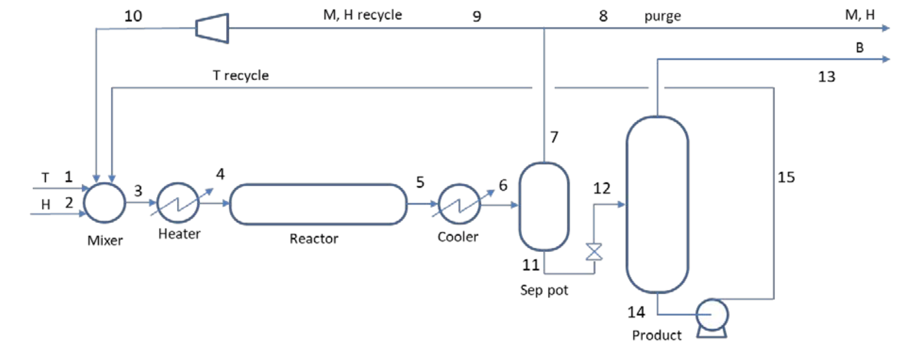

# Hydro-dealkylation Process Operation

## Project Overview
This work was completed as the final project for 10.10 Introduction to Chemical Engineering in Fall 2019. The motivation includes: 
* Perform an engineering task that is realistic in several respects
* Use experience in material and energy balances and Matlab programming to simulate
the operation of a chemical process and estimate its profitability
* Learn incidental information about chemical processes, design procedures, technical
calculations, and the sorts of simplifications that engineers make to finish otherwise
impossible tasks
* Cooperate with others as a team to achieve a shared goal

## Problem Statement
TenTen Industries is exploring the business of producing benzene by removing the methyl group from toluene. Called hydro-dealkylation (HDA), the reaction occurs by reacting toluene with hydrogen; methane is produced as a byproduct. The goal is to produce 80,000 Mg/year of 99.5 wt% benzene. The project involves performing a preliminary process design and profitability estimate to guide the company's decision.

Liquid toluene is pumped from storage (1), combined with hydrogen (2) and recycle streams (10) (15), and heated to reaction temperature, at which it will be entirely vapor (4). The effluent from the adiabatic reactor (5) is cooled to condense product benzene and unreacted toluene (6). The phases are separated in a vessel; the gas phase (7), which contains some B and T vapor, is split into purge (8) and recycle (9) streams. The purge stream is used as a fuel gas. The recycle is compressed to feed pressure (10) before joining the makeup streams. The liquid stream (11) from the separator vessel is let down to lower pressure (12) before entering a distillation tower. Benzene product is taken overhead (13) as liquid for storage, and the bottoms stream (14) is pumped to feed pressure for recycle (15).

## Simulating the Process
There is a matlab script (.m file) for each of the nine individual operations. Several helper functions are saved as live scripts (.mlx files). The entire process can be simulated by running [process.mlx](/matlab%20code/process.mlx), and the profitability estimate can be obtained by running in [Profitability.m](/matlab%20code/Profitability.m).

## Authors
Ming Ying Yang, MIT '22, MEng '23

Tamara Brabson, MIT '22

Anna Johnson, MIT '21
